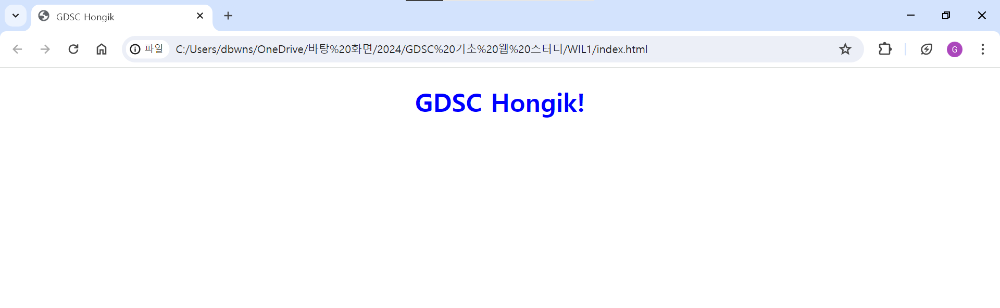

#### 1주차 웹 개발의 역사
웹 개발의 역사와 현재 React의 환경에 대해 설명할 수 있다. (이번 주)

HTML / CSS / JavaScript가 무엇인지 그 역할을 알 수 있다.

웹 통신 (HTTP, 상태코드, 메서드, 캐시, 헤더로 구성)

웹을 내 개발 환경에서 띄울 수 있다.

기본적인 웹 통신을 할 수 있다.

1. 웹의 역사
   
   React의 개발자 Facebook 사례(발전 과정)

   2004년에 Facebook이 탄생했을 때, LAMP 스택(Lambda, API Gateway, MySQL, PHP)

   데이터베이스가 필요로 하는 데이터를 불러 와서, 웹 서버에서 HTML 페이지를 모두 만들어 클라이언트에 제공함

   이 때 웹 브라우저는 HTML 다운로드 및 정보 제공의 역할만 했고, 이 때의 JavaScrpit는 정보 입력과 같은 부수적인 역할만 수행했다.

   MySQL > API Gateway >
    HTML
    
    컨텐츠는 서버에서 동적으로 생성

    이후, 2010년에 제이쿼리 등장

    HTML 속에서 클라이언트에서 동작 가능한 스크립트 언어를 동작할 수 있게 하는 라이브러리이고, 
    
    
    JavaScript를 더욱 쉽게 작성할 수 있도록 사용되었음.

    ES5(ECMAScript5)의 채택

    local storage 등장

    현재는 ES6이 통용될 정도로 발전 속도가 빠르다.

    브라우저는 점점 사용자와 상호 작용을 더 원활히 할 수 있게 발전

    DOM : Document Object Model

    자바스크립트는 DOM을 수정해 다양한 웹의 인터렉션을 구현하기 시작
    
    페이지 일부만을 업데이트하여 동적으로 서버와 통신

    JavaScript 환경은 점점 더 복잡해지고, 
    7억명 이상의 유저를 보유한 Facebook은 자바스크립트 코드를 최소화하고자 했지만 서버 랜더링이 처리할 수 있는 규모에는 한계가 존재
    
    *좋아요 클릭하면 서버에 반영되고 랜더링하는 과정 

    Facebook은 React를 개발하기 시작, 상태(state)의 개념을 활용해 상태에 따른 UI를 선언적으로 구현
    JSX 문법을 활용하여 JavaScript 코드의 규모를 축소

    처음의 React를 향한 불신은 근거가 있었음.

    HTML과 JavaScript를 한 곳에 두는 것은 관심사 분리 원칙에 어긋나다는 게 이유.

    하지만 시간이 지남에 따라 자연스레 인정받음.

    선언적으로 컴포넌트를 작성한다는 개념, 가상 DOM과 조작의 효율성 증진

    2013년에 React의 최초 공개 발표 이후 2023년에 React 18, 2024년에 React 19가 발표됨.
    개발 속도가 매우 빠르다.

    점유율을 보더라도, 채용 공고를 보더라도 웹 프론트엔드 개발은 React가 점령함.

    #### 과제를 수행하며 배운 점

    HTML과 CSS가 뭔 지도, 어떻게 작성하는 지도 몰랐는데 생각보다 작성법이 어렵지 않아서 유튜브 영상 몇 개만으로 과제가 구현되어 신기했다.

    ### 과제 사진
    
