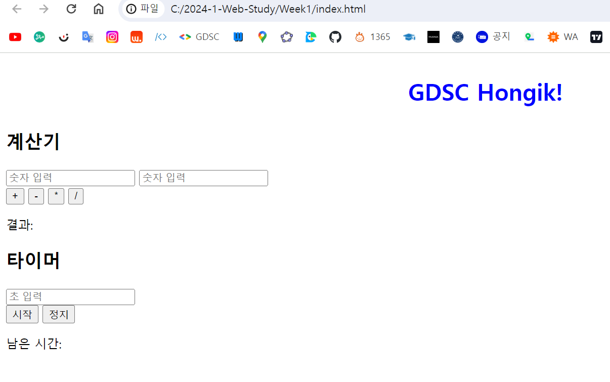

# WIL2
## 2주차 - HTML, CSS, JS

### HTML은 무엇인가
HTML은 프로그래밍 언어가 아니라 마크업 언어이다.
 
프로그래밍 언어로 인정하기 위해서는 조건문, 변수, 반복 루프 등이 필요하다. 
 
마크업이란, 태그를 이용하여 문서나 데이터의 구조를 표현하는 언어의 한 가지 종류이다.
 
HTML, XML, 지금 작성하고 있는 WIL에서 쓰는 문법,  Markdown 언어도 동일하다. 
 
HTML = Hyper Text Markup Language
 
초본문표식달기언어
 

### CSS는 언제 적용되는가
CSS = Cascading Style Sheets 
 
종속형 시트, 캐스케이딩 스타일 시트
 
브라우저는 사용자가 선택한 자원(=Resource)을 서버에 요청(=Request)하고, 서버로부터 받은 응답(=Response)을 브라우저에 랜더링한다.(=Render)
 
랜더링까지의 과정 알아보기
 
네이버에 뉴진스 검색
 
-> F12(개발자 도구)를 눌러서 네트워크 탭
 
현재의 네트워크 상황을 확인할 수 있음
 
네이버의 IP 주소 ! : https://125.209.222.141
 
우리는 www.naver.com (도메인 네임)으로 연결
 
인터넷은 IP 주소를 이용해 통신 <-> 인간은 모든 IP 주소를 기억하기 어려움
 
아까 열어놓은 개발자 도구의 네트워크 창에서 보이는 것들
 
응답 시간: 몇 십만 밀리초? 
 
search.naver.com/~~~, 헤더와 페이로드, Body
 
GET /test.html HTTP/1.1(start line)
 
headers
 
blank line, body
 
query는 뉴진스, 요청들이 알아보기 어렵게 쓰여 있지만 정리하면 그냥 naver.com 호스트, http 요청과 웹 서버에의 요청 정도인 듯
 
*찾아낸 것
 
php: Hypertext Preprocessor / Personal Home Page
 
동적 웹 페이지를 만들기 위해 설계된 범용 프로그래밍 언어, 서버 사이드 스크립트 언어 
 
전 세계 수많은 웹 시스템의 기반이 되는 언어로 비슷한 언어로는 내가 많이 들어본 Perl, Ruby 등이 있음.
 
아까 개발자 도구의 네트워크 탭에서 헤더 -> 응답으로 넘어가게 되면 익숙한 문법들이 등장. 응답 Body에 html과 헤드, 그리고 엄청나게 긴 코드들이 등장함.
 
하지만, 이를 모두 읽어보고 갖다 쓰려고 하더라도 보안 때문인가 숨겨둔 것들과, 연결되는 다른 파일?과 코드? 때문에 막힐 것
 
내가 작성한 HTML, CSS 파일이 언제 화면에 보여지는가?
 
브라우저를 이루는 컴포넌트 그림(웹 브라우저 구조의 이해)에서 UI->Browser Engine->Rendering Engine으로 이어지는 구조 하에 가장 중요한 것이 Rendering Engine이다. 
 
중요 랜더링 경로(Critical Rendering Path): 속도 저하 구간이 생기면 좋지 않으므로, 성능을 좌지우지할 수 있는 중요한 경로
 
파싱->렌더 트리 구축->레이아웃 리플로우->페인트
 
이 각 단계를 최적화함으로써 성능 향상에 기여함
 
파싱: 컴퓨터에서 컴파일러 또는 번역기가 원시 부호를 기계어로 번역하는 과정의 한 단계로, 각 문장의 문법적인 구성 또는 구문을 분석하는 과정. 즉 원시 프로그램에서 나타난 토큰(token)의 열을 받아들여 이를 그 언어의 문법에 맞게 구문 분석 트리(parse tree)로 구성해 내는 일이다. 파싱은 크게 하향식 파싱과 상향식 파싱으로 나눌 수 있음.
 
출처: [네이버 지식백과] 파싱 [parsing, 文章-分析] (IT용어사전, 한국정보통신기술협회)
 
HTML을 파싱하여 Parse Tree 만들기 (DOM)
 
Bytes->Characters->Tokens->Nodes->DOM
 
마인드맵과도 같이 생긴 이 가지들
 
html->head, body->div->img
 
CSS를 파싱, Parse Tree 만들기 (CSSOM)
 
CSSOM: CSS Object Model 은 JavaScript에서 CSS를 조작할 수 있는 API 집합입니다. HTML 대신 CSS가 대상인 DOM이라고 생각할 수 있으며, 사용자가 CSS 스타일을 동적으로 읽고 수정할 수 있는 방법입니다.
 
출처: developer.mozilla.org/ko
 
CSS를 사용하는 방식을 알아보자. html 문법 중에서 <link rel="stylesheet" href="./main.css />

 
라는 문장, 이는 외부 stylesheet에서 CSS를 불러오는 경우임
 
body 안에 style로 삽입:
 
HTML 태그에 직접 style 주입, inline 형식
 
레이아웃(리플로우), 페인트
 
레이아웃 (리플로우): 랜더 트리에서 계산된, 계산되지 않은 노드의 크기, 위치 계산, 이를 좌표로 정리한 것
 
페인트: 좌표를 바탕으로, 요소들에 색을 입히고 위치를 결정하여 브라우저를 만듦
 
리플로우의 정의: 생성된 DOM노드의 레이아웃 변경 시 영향을 받는 모든 노드(부모, 자식)의 수치를 다시 계산하여 레이아웃 트리(렌더트리)를 재생성하는 작업을 의미한다.
 
출처: velog.io/@leebonggu12
 

### 웹에서의 JS의 역할
JS는 DOM(Document Object Model)을 통해 HTMl 문서의 구조, 스타일, 콘텐츠 등을 조작할 수 있음
 
JS에는 다양한 DOM 접근 메서드를 사용할 수 있음
 
get 이하에서 특정한 요소나 값들을 가져올 수 있고, query 이하에서 다양한 선택, 조작과 관련된 동작들을 할 수 있음
 
DOM 요소의 스타일, 콘텐츠 그리고 속성을 변경할 수도 있음 
 
Blink라는 렌더링 엔진(크로미움 기반 브라우저), Js 엔진 V8(구글)
 
Inline CSS의 장단점
 
HTML 요소의 style 속성에 직접 CSS 스타일을 적용하는 방식
 
권장하지 않는 이유가 있음
 
좋은 점은 무엇보다 빠르고 쉽다는 점, 무엇이 바뀌는지 미리 확인할 때 편하고 유용하다는 정도
 
단점으로는 CSS 속성의 중복, 재사용성이 떨어진다는 것과 고급 CSS 기능(키프레임?: 애니메이션 속성과 관련됨)을 쓸 수가 없게 된다는 것, 또 유지보수가 어렵다는 치명적인 단점이 있다.
 
일반적으로는 외부 CSS 파일이나 내부 스타일시트를 사용하는 것이 더 효과적
 

### 실생활에서 사용되는 웹의 구성

#### 과제
이미지
 
