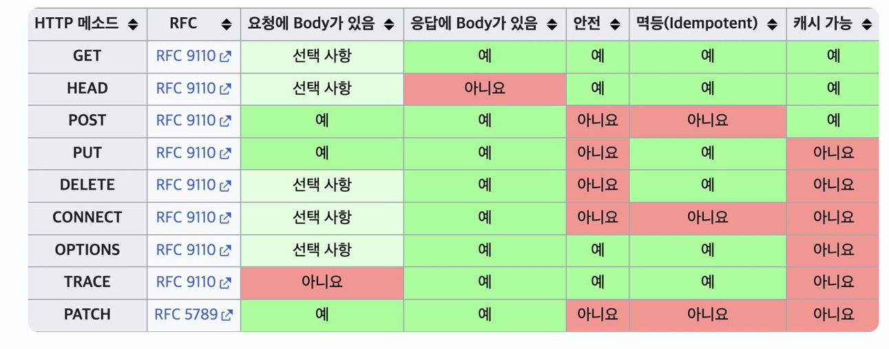
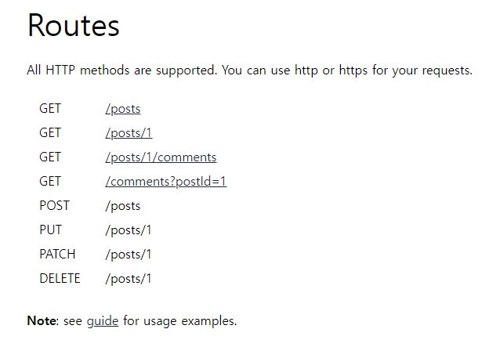
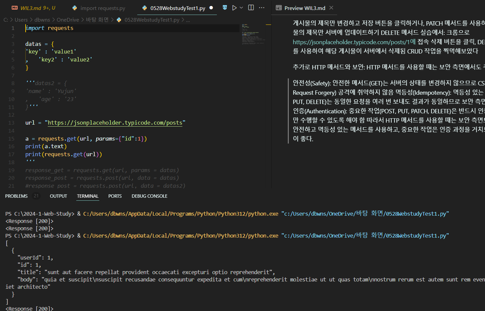
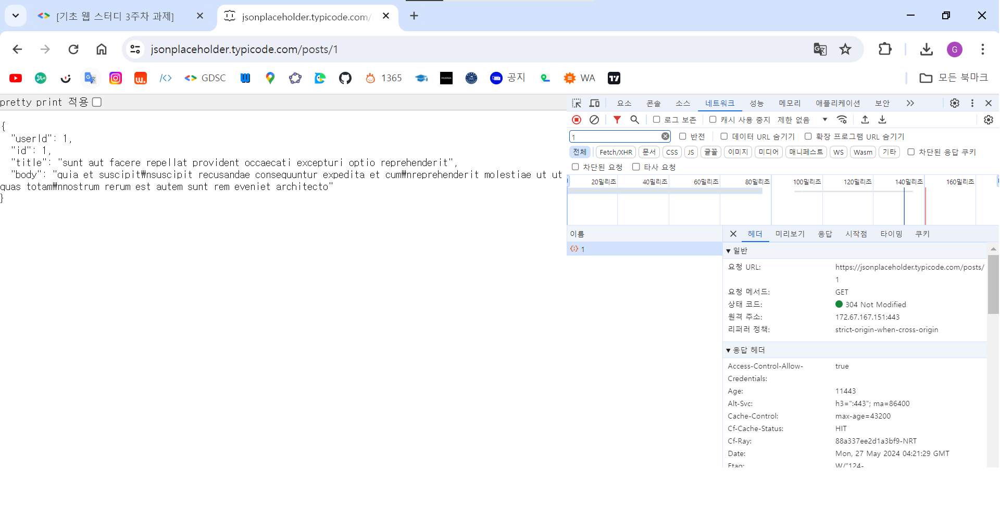

지난 주
JS가 웹 브라우저에서 어떻게 작동하는지 알아봄
면접 질문에 답변할 수 있게 됨
DOM Tree 구조 트리 만들기도 알아봄

싱글 스레드임에도 복잡한 과정들로 많은 것들이 돌아가는 이유가 무엇일까

이번 주
3주차 수업
HTTP, API 설계
이번 주의 학습목표
네트워크의 기본
 HTTP를 설명할 수 있다
 API 설계의 기본 과정을 살펴본다
 API 설계 시 리소스와 행위를 분리할 수 있다
 HTTP 메소드를 설명할 수 있다

JavaScript와 브라우저의 관계
저번 주에 배웠던 DOM 생성 프로세스 X 자바스크립트 엔진이 전담

JS는 싱글 스레드 언어이다
Stack에 순서대로 JavaScript 코드를 쌓는다
브라우저에서 제공하는 API (Web API) (버튼 클릭 이벤트나, http 요청 등)
Callback Queue에 넣는다
Stack이 비어있는 시간에 event loop를 작동시켜 콜백 함수를 실행

JS 예문:
setTimeout(function() {
    console.log("first")
} , 0)
console.log("second")

second -> first 순으로 출력

1. HTTP는 무엇일까
웹 통신의 기본
Hyper Text Transfer Protocol
HTML 전달 프로토콜
현대에서 가장 많이 쓰이고 있는 HTTP 버전: 1.1
RFC2068 (1997) -> RFC2616 (1999) -> RFC7230 ~ 7235(2014)
HTTP/2, HTTP/3이 계속 개발 & 발전 중이지만, 1.1의 버전을 바탕으로 성능 개선
현재의 HTTP는:
2022년 6월에 HTTP/3가 IETF(Internet Engineering Task Force)의 표준이 됨
아직 웹에 바로 적용되지는 않았지만, 준비의 필요성 有

TCP/UDP
TCP: HTTP/1.1, HTTP/2
UDP: HTTP/3
작년에 정보처리기능사 공부했을 때 배웠던 내용.

아래 계층 관련 내용도 同
애플리케이션 계층 HTTP FTP
전송 TCP UDP
인터넷 IP
네트워크 인터페이스 계층

찾아본 내용
TCP에만 연결 개념이 있다
UDP Header 형식은 TCP 헤더 형식과 다르게
영상을 송출하는 경우 클라이언트의 네트워크 상황에 맞추지 않고 영상을 송출
그래서 배려 없는 프로토콜이라고 볼 수 있다?
그 외에도 port 번호, 2^16-2개 가용, 일련 번호, sequence num, 상태를 결정하는 flag 등 못 들어본 용어도 많다.
Zero Window: 어플리케이션 레벨에서 발생하는 장애 상황. 상대가 받을 수 없는 상황. TCP는 이 경우 보내지 않고, UDP는 보낸다.
TCP, UDP 식별자: Port 번호, Segment, Datagram
당연히 클라와 서버로 구성
출처 : https://velog.io/@heelieben/

채팅으로 대화하는 과정에서:
크롬: 메시지가 소켓에 전달됨
전송 계층: 메시지가 TCP 정보를 가지게 됨
인터넷 계층에서 메시지가 IP 패킷을 생성
이후 이더넷 정보를 포함(랜카드 주소 등..), 메시지 전달

이더넷: LAN, MAN, WAN에서 가장 많이 사용되는 규격
osi 모델에서 [물리] 계층: 신호와 배선,
[데이터 링크] 계층: MAC패킷, 프로토콜 형식 정의
IEEE 802.3 규약으로 표준화
출처 : 위키백과

돌아가서, TCP 패킷 정보는 출발지 포트 번호, 목적지 포트 번호나 전송 제어 정보, 전송의 순서, 검증 관련된 정보
IP 패킷 정보는 출발지와 도착지의 IP 주소를 담당

TCP의 정의 부분에서 다시 본 3 way handshake:
TCP에서 통신을 하는 장치간에 서로 연결이 잘 되어있는지 확인하는 과정 또는 방식
+송수신자(데이터를 주고 받는 상호)사이에 연결을 확인하는 과정

연결지향적: 
상대방이 내 신호를 받을 수 있는지 확인 후 전송
1단계: 연결요청 메시지 전송, SYN이라는 랜덤 숫자 함께 전송
2단계 : 서버가 요청을 수락, 클라이언트에게도 들리냐는 의미의 연결 요청 메시지를 전송
메시지에 ACK를 포함, 이는 받았던 SYN보다 +1한 값을 가짐
3단계: 클라이언트가 서버에게 잘 들린다는 뜻으로 ACK+1이라는 값을 전송
출처 : 네이버 블로그(펭거, kgm7642)

Stateless(무상태):
서버가 클라이언트의 상태를 보존하고 있지 않음
통신이 끝나면 더 이상 상태 유지 X
다음과 같은 문제 발생:
사이트에 로그인을 했는데, 페이지를 이동할 때마다 이전의 로그인이 유지되지 않아 매번 로그인을 해야 한다.
분명 사이트에 들어가서 팝업을 하루동안 보지 않기로 체크를 했는데, 페이지를 유지할 때마다 매번 팝업창이 떠서 팝업을 닫아야 한다.
<-> Stateful
보완을 위해 이용하는 게 바로 Cookie, Session
출처 : https://velog.io/@bambookim/

HTTP의 이 비연결성은 빠른 응답과 서버 자원의 효율적 이용이라는 장점을 가짐
단점은 TCP/IP 연결을 매번 새로 해야 하니까 3way handshake 시간이 추가로 소요
브라우저를 로딩할 때 HTML 말고도 JS,CSS, 이미지 등의 자원이 많음

이를 개선해서 HTTP/2나 HTTP/3은
필요한 자원들을 모두 다운로드받을 때까지 연결이 종료되지 않고 요청, 응답의 반복 이후 종료되도록 함

HTTP API와 메서드
지뎃시 코어 멤버가 하는 일
서버 개발자, 온보딩 서비스 고도화
여러 수요를 url 만들어서 공급
이 생성은 리소스를 기준으로 함 
/멤버 뒤에 /id가 와야 당연한 서순..
url은 리소스 식별의 주요 인식표와도 같다
리소스와 행위를 구별 구분하여서 볼 수 있어야 하니까
이 행위는 메서드를 통해서 식별할 수 있음

http 메서드 - get
정보를 조회하기 위한 메서드
서버에 전달하고픈 데이터는 query로(쿼리 파라미터, 스트링)
get 요청에 body는 잘 사용하지 않음
왜?: 
HTTP 메서드 중 GET 요청에 body를 잘 사용하지 않는 이유는 여러 가지가 있습니다:
표준 및 명세: HTTP/1.1 명세(RFC 7231)에 따르면, GET 요청의 본문(body)은 명시적으로 금지되지 않지만, GET 요청에 본문을 포함하는 것은 일반적인 사용 사례가 아닙니다. 
대부분의 서버, 프록시, 클라이언트는 GET 요청의 본문을 무시하거나 제대로 처리하지 않을 수 있습니다.
캐싱 및 브라우저 동작: GET 요청은 주로 데이터를 조회하기 위해 사용되며, 캐싱이 가능하도록 설계되어 있습니다. 
캐시 시스템과 브라우저는 GET 요청의 URL을 기반으로 캐싱을 수행하는데, 본문이 포함될 경우 캐싱 메커니즘이 제대로 작동하지 않을 수 있습니다.
안정성 및 멱등성: GET 요청은 서버의 상태를 변경하지 않는 안전한 요청이어야 하며, 멱등성을 가져야 합니다. 본문을 포함하면 이러한 특성이 훼손될 가능성이 있습니다.
호환성 문제: 많은 서버와 네트워크 장비들은 GET 요청의 본문을 제대로 처리하지 못할 수 있습니다. 
이는 예기치 않은 오류를 발생시키거나 요청이 무시되는 결과를 초래할 수 있습니다.
따라서 GET 요청의 경우 필요한 모든 데이터를 URL의 쿼리 파라미터로 전달하는 것이 일반적입니다. 
데이터를 서버로 전송해야 하는 경우, POST, PUT, PATCH와 같은 다른 HTTP 메서드를 사용하는 것이 더 적절합니다.
출처 : GPT4

http 메서드 - post
naver blog에 글 작성
요청 url: RabbitWrite.naver가 뒤에 붙음
요청을 처리하기 위한 메서드
서버에 전달하고 싶은 데이터는 body에
body를 통해서 들어온 데이터를 처리함
전달된 데이터를 통해서 리소스를 관리

응답 란의 result 확인:
쓴 글이 아직 서버 데이터에서 존재하지 않는 상태라고 볼 수 있음
post 요청을 통해 서버에 내 게시글이라는 새 리소스를 생성하는 것
즉 이 예제에서 post의 결과로 새로운 리소스를 생성, 등록해주는 역할임을 알 수 있음

새로운 리소스를 등록하는 역할
사용자가 웹으로 진행하고 있는 어떤 과정의 상태를 변경하는 경우
다른 메서드를 사용하기 어려운 경우 (어쩔 수 없을 때)

http 메서드 - PUT
리소스를 대체하는 메소드
리소스가 있으면 대체 진행
리소스가 없으면 생성.
'덮어쓰기'의 개념

블로그 글 수정할 때, post id 에 같은 것을 지정 (/1)

http 메서드 - PATCH
리소스를 부분 대체
username과 age 두 값이 있을 때 하나만 바꾸는 경우
http 메서드 - delete
리소스를 제거

특징들)

요청 응답 body 유무, 안전성, 멱등성, 캐시가능여부
connect, options, trace?
connect:
클라이언트가 서버와의 TCP 터널을 설정할 때 사용. 주로 HTTPS 요청을 프록시 서버를 통해 전송할 때 사용됨
ex: 클라이언트 → 프록시 서버 → 원격 서버로 HTTPS 연결을 설정하기 위해 사용.
options:
특정 URL 또는 서버에서 지원하는 HTTP 메서드를 확인하기 위해 사용. 서버는 응답 헤더에 지원하는 메서드를 나열.
ex: 클라이언트가 서버에 OPTIONS 요청을 보내어 서버가 지원하는 메서드(GET, POST 등)를 확인.
trace:
클라이언트가 요청을 서버로 보내고, 서버는 이 요청을 되돌려 보냄. 이를 통해 요청이 서버에 도달하는 과정을 추적하고 진단할 때 사용됨.
ex: 클라이언트가 TRACE 요청을 보내어 네트워크 경로를 따라 요청이 변경되었는지 확인.
각 메서드는 특정한 목적을 위해 사용되며, 일반적인 CRUD(Create, Read, Update, Delete) 작업보다는 특별한 상황에서 유용
출처: gpt4의 답변을 요약

api 설계를 마무리할 때:
아까 수요들 보면서 메서드 연결시키기
조회: get
검색 후 조회: /id, get
신규 등록: /id, post
정보 수정: /id, patch/put/post
탈퇴 및 삭제 처리: /id, delete/post

WIL 탑재 과제:
HTTP 환경 직접 체험해보기
GET, POST, PUT, PATCH, DELETE를 직접 체험해보고 그 사용 사례를 정리
HTTP/1.1, HTTP/2, HTTP/3의 차이점을 학습하고 그 역사를 정리
GET, POST 메소드의 헤더 분석하여 각각의 역할을 정리
Content-Type, Accept, Authorization 등Wireshark를 활용하여 HTTP 패킷을 분석 (예습, 선택)

개발자 도구 F12 말고도 우클릭하면 볼 수 있음

대충 알고 있었던 MySQL 문법이나 DB 구축, 테이블을 만들어 실습하는 건
시도해보았으나 너무 복잡하고 알아볼 게 많아서 다음에 하도록 하고, 
웹에 구축된 테스트용 사이트에서 개발자 도구를 활용해서 실습을 대체했다

실습 사이트:
무료 가상 Rest API 서버를 검색해서 JSONPlaceHolder라는 곳을 찾음
https://jsonplaceholder.typicode.com/posts/1에 접속

추가로, 구글 확장 프로그램 테스트 rest-api: talend api tester free edition을 받아봄
또, https://blog.naver.com/gikimirane/222666913565에서 알아낸 사이트:
https://resttesttest.com/
http://httpbin.org/
https://putsreq.com/

먼저 HTTP 메서드 개요를 정리하면:
GET: 리소스를 가져오는 데 사용. 데이터를 서버에 보내지 않고 URL에 포함시켜 요청.
POST: 새로운 리소스를 생성하는 데 사용. 데이터를 요청 본문에 포함시켜 보냄.
PUT: 기존 리소스를 업데이트하는 데 사용. 요청 본문에 새로운 리소스 데이터를 포함시켜 보냄.
PATCH: 기존 리소스의 일부를 업데이트하는 데 사용. 요청 본문에 업데이트할 데이터만 포함시켜 보냄.
DELETE: 리소스를 삭제하는 데 사용.

GET 메서드 사용 사례
GET 메서드는 리소스를 가져오는 데 사용됨. 예를 들어 웹 브라우저에서 URL을 입력하면 GET 메서드를 사용하여 해당 페이지의 HTML 문서를 가져옴.

실습:
웹 브라우저에서 주소를 입력하면 GET 메서드를 사용하여 해당 웹 페이지의 HTML 문서를 가져옴.
웹 브라우저에서 주소 뒤에 /users?page=(?)을 입력하면 GET 메서드를 사용하여 사용자 목록 데이터를 가져옴.

POST 메서드 사용 사례
POST 메서드는 새로운 리소스를 생성하는 데 사용. 예를 들어 웹 양식에 데이터를 입력하고 제출하면 POST 메서드를 사용하여 해당 데이터를 서버에 전송.

실습:
웹 브라우저에 접속, 사용자 정보를 입력한 후 제출 버튼을 클릭하면 POST 메서드를 사용하여 새로운 사용자 데이터가 서버에 전송.

PUT 메서드 사용 사례
PUT 메서드는 기존 리소스를 업데이트하는 데 사용. 예를 들어 사용자 정보를 수정하고 저장하면 PUT 메서드를 사용하여 해당 데이터를 서버에 전송.

실습:
웹 브라우저에서 user 정보에 접속하고 사용자 정보를 수정한 후 저장 버튼을 클릭하면 PUT 메서드를 사용하여 해당 사용자 데이터가 서버에 업데이트됨.

PATCH 메서드 사용 사례
PATCH 메서드는 기존 리소스의 일부를 업데이트하는 데 사용. 예를 들어 사용자의 이메일 주소만 변경하고 싶을 때 PATCH 메서드를 사용할 수 있음.

실습:
웹 브라우저에서 user 정보에 접속하고 사용자의 이메일 주소만 수정한 후 저장 버튼을 클릭하면 PATCH 메서드를 사용하여 해당 사용자의 이메일 주소만 서버에 업데이트함

DELETE 메서드 사용 사례
DELETE 메서드는 리소스를 삭제하는 데 사용. 예를 들어 사용자 계정을 삭제하고 싶을 때 DELETE 메서드를 사용할 수 있음

실습:
웹 브라우저에서 user 정보에 접속하고 삭제 버튼을 클릭하면 DELETE 메서드를 사용하여 해당 사용자 계정이 서버에서 삭제됨.
메서드를 사용하니까 많은 CRUD 작업을 수행할 수 있음. 

게시물의 제목만 변경하고 저장 버튼을 클릭하거나, 
PATCH 메서드를 사용하여 해당 게시물의 제목만 서버에 업데이트하기
DELETE 메서드 실습에서:
크롬으로 https://jsonplaceholder.typicode.com/posts/1에 접속
삭제 버튼을 클릭, DELETE 메서드를 사용하여 해당 게시물이 서버에서 삭제됨
CRUD 작업을 찍먹해보았다

추가로 HTTP 메서드와 보안:
HTTP 메서드를 사용할 때는 보안 측면에서도 주의해야 함

안전성(Safety): 안전한 메서드(GET)는 서버의 상태를 변경하지 않으므로 CSRF(Cross-Site Request Forgery) 공격에 취약하지 않음
멱등성(Idempotency): 멱등성 있는 메서드(GET, PUT, DELETE)는 동일한 요청을 여러 번 보내도 결과가 동일하므로 보안 측면에서 유리함
인증(Authentication): 중요한 작업(POST, PUT, PATCH, DELETE)은 반드시 인증된 사용자만 수행할 수 있도록 해야 함
따라서 HTTP 메서드를 사용할 때는 보안 측면도 고려해야. 안전하고 멱등성 있는 메서드를 사용하고, 중요한 작업은 인증 과정을 거치도록 하는 것이 좋다.

알고 보니 점프 투 파이썬 wikidocs에도 jsonplaceholder를 이용해 http 메서드 테스트하기 실습이 있었습니다. 참고했습니다.

실습 사진
[!GET](GET.png)
[!GET2](GET2.png)
[!GET3](GET3.png)
[!POST](POST.png)
[!PUT](PUT.png)
[!PATCH](PATCH.png)
[!DELETE](DELETE.png)

