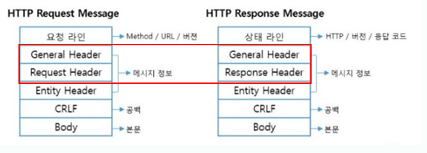
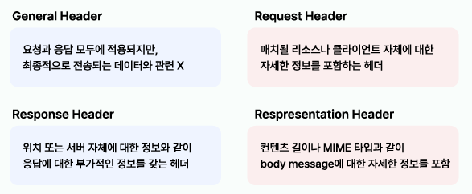

### 4주차
HTTP통신을 직접 해 볼 수 있다.  HTTP를 활용하여 클라이언트에서 서버로 데이터를 전송하는 방식을 확인한다.  HTTP API 설계가 어떻게 되어 있는지 알 수 있다.  HTTP 상태코드를 설명할 수 있다.  HTTP 헤더, 캐시에 대해 설명할 수 있다.

저번 주에는 http 활용, api 전송 연습을 해보았음 
쿼리 파라미터로 데이터 전송 = get(검색) 
get으로 body에 정보 담아 전송하는 오류. 
메시지 body로 데이터 전송 = post, put, patch(블로그 글작성) 
gdsc api 소개 
#### http 상태코드 
통상적으로 쓰는 상태코드의 십의 자리, 일의 자리는 가능한 수백 개지만, 15개 정도만 사용한다고 보면 된다. 
그리고 이것도 외울 필요가 없고, 백의 자리만 구분해서 해석하자. 
100번대(Informational):요청이 수신되어 처리 중  
200번대 (Successful) : 요청 정상 처리  
300번대 (Redirection) : 요청을 완료하려면 추가 행동이 필요 
400번대 (Client Error) : 클라이언트 오류, 잘못된 문법 등으로 서버가 요청을 수행할 수 없음   500번대 (Server Error) : 서버 오류, 서버가 정상 요청을 처리하지 못함
 
100번대는 정보 제공의 목적이 큰 대신 잘 사용하지 않음
 
200번대  
200 OK : 서버가 요청을 성공적으로 처리하였음을 나타냄 201 Created : 요청이 처리되어서 새로운 리소스가 생성되었음 202 (Accepted) : 요청은 접수되었지만, 처리가 완료되지 않음.  204 (No Content) : 처리를 성공하였지만, 클라이언트에게 돌려줄 콘텐츠가 없음. (삭제)  
204 No Content는 서버에 요청을 보내면 응답 body에 데이터를 담아서 제공해준다   204는 body에 아무런 내용을 담지 않고 보낼 때 사용한다 
300번대 
클라이언트의 요청을 끝마치기 위해서, 웹 브라우저의 추가적인 동작이 필요한 상태 300 Multiple Choices : 선택 항목이 여러 개 존재 301 Moved Permanently : 지정한 리소스가 새로운 URL로 이동.  302 Found : 다른 위치로 요청을 진행하라. 브라우저의 폼 요청을 POST 처리 후 리다이렉트함  304 Not Modified :  마지막 요청 이후 페이지가 수정되지 않았음  305 Use Proxy :  지정한 리소스에 액세스하려면 프록시를 통해야 함 307 Temporary Redirect :  임시로 리다이렉션 요청이 필요 

proxy 
클라이언트와 서버 사이의 중개자 역할을 하는 전용 서버나 소프트웨어 시스템. 컴퓨터는 직접 인터넷에 연결되지 않아도 되는 대신, 모든 데이터 트래픽은 프록시 서버를 통해 이루어짐. 웹 페이지를 요청하면 프록시 서버가 대신 그 페이지를 가져다 주는 것.
[출처] 네이버블로그 쯔미
 redirect 
특정 요청을 받았을 때 현재 웹 페이지를 특정 URL로 이동시키는 프로세스

MIME(Multipurpose Internet Mail Extensions
)
payload(전송되는 데이터 자체)

상품 주문할 때 새로고침 하면 파산할 수 있는 사례  
POST 요청 이후 화면을 그대로 두지 않고, GET 메서드로 주문 결과 화면을 리다이렉트시킴중복 주문이 방지되고, 결과 화면을 새로고침 결과 여러 번 보게 됨

304 Not Modified

클라이언트가 갖고 있는 캐시를 그대로 사용해도 됨을 서버가 알려주는 상태 코드캐시로 리다이렉트 시켜 줌 응답에 메시지 body가 없음 (로컬 캐시를 이용)

400 Bad Request
클라이언트의 잘못된 요청. 서버가 처리할 수 없는 상태
API 명세에 맞지 않게 요청을 보내거나 파라미터 오타 실수 요청 구문, 메시지 등등 오류 발생 400 상태코드를 내보내야 하는 오류를 실수로 500 에러로 내보내게 된다면 같은 실수를 반복하여 수행하게 될 것이기 때문에 디버깅에 중요

401 Unauthorized
클라이언트 요청이 해당 리소스에 대한 인증이 필요 www-Authenticate 헤더에 인증 관련 정보를 채워야 함 즉, 인증이 되지 않은 요청인 것임

인증 Authentication(로그인)과 인가 Authorization(Admin, Manage권한)의 차이

403 Forbidden

서버에서 요청은 확인했지만, 리소스에 접근하는 것에 대한 승인을 거부 인증은 하였지만, 접근할 수 있는 권한이 없는 경우

ex. GDSC Hongik 학회원이 학회원 어드민 서비스 DB에 접근하는 예시

404 Not Found
많이 본 코드 
요청한 리소스를 찾을 수 없음  요청한 리소스가 서버에 존재하지 않을 때 리소스가 서버에 존재하지만, 권한이 없어 리소스를 숨기고 싶을 때

500 Internal Server Error 
서버 문제, 백엔드 에러

503 Service Unavailable
 
서버 일시적 과부하, 서버 서비스 점검 등으로 잠시 요청 처리 불가
 
Retry-After 나중에 이용 가능해지는 때
  언제부터 이용 가능한지 정보 확인 가능
 
#### HTTP 헤더 뜯어보기

이미지를 머리 속에 암기하자..

Content-Type이나 Content-Length에서, 표현 헤더
  표현 데이터는 html 이하.   메세지 본문인 페이로드를 통해 표현 데이터 전달   즉 표현 헤더는 표현 데이터를 나타내는 추가 정보로, =html, json, 데이터 길이 등
해시,트랙터

표현 헤더에 콘텐트 뒤에 붙는 것에 따른 대표적 의미와 예

Type 형식 (json, html)

Encoding 압축 방식 (gzip, deflate)

Language 자연 언어 (ko, en)

Length 길이 (byte)

요청 헤더 (Request Header) - 협상 헤더 클라이언트가 이해 가능한 컨텐츠 타입이 무엇인지 알려줌 (선호 형식 안내)  Accept: 클라이언트가 선호하는 미디어 타입 전달 Accept-Charset: 클라이언트가 선호하는 방식의 문자 인코딩 Accept-Encoding: 클라이언트가 선호하는 압축 인코딩 방식 Accept-Encoding: 클라이언트가 선호하는 자연 언어  클라이언트가 제공한 선호 방식을 최고 우선순위에 두고 고려

애플 홈페이질 예시
 
다중 언어 지원, 우선 순위 알림 Accept에서 구체적일수록 우선순위 ↑
 
Referer로 어디에서(예시에선 구글) 접속했는지 확인 가능
 
User-Agent로 실무에서도 유저 분석에 쓰임(예시)

IP 통신, 포트 명시

www-Authenticate : 리소스 접근 시 필요한 인증 방법을 정의해둔 헤더

일반적인 응답 헤더 정보
 
날짜/시간(Date) 리다이렉션 필요시 그 URL (Location) 서버에서 응답 처리(Server) 

#### 쿠키
서버에서 클라이언트로 쿠키 전달 (set-cookie), 응답 헤더

클라이언트가 서버에서 받은 쿠키를 저장 (cookie), http 요청 시 서버로 전달

저번 시간에 공부한 http의 무상태 특성

로그인할 때 유저 정보를 쿠키 저장소에 저장, 후에 클라이언트 컴퓨터와 주고받는 형태

해쉬값과 같은 쿠키가 로컬에 저장, 매번 로그인 다시 할 필요 없어짐(자동 로그인)

이 세션을 서버에서 관리하지 않고 내부에서 데이터를 관리하려면 localStorage 사용

형태

Secure : https인 경우에만 전송

HttpOnly: XSS 공격을 방지하고, 자바스크립트에서 쿠키 접근 불가하도록 함, HTTP에서만 사용

SameSite : XSRF 공격 방지, 요청 도메인과 쿠키에 설정된 도메인이 같을 때만 쿠키 전송도메인이 생략되어 있으므로, GDSC Hongik 어드민 서비스의 도메인에서만 사용하는 쿠키

#### 캐시
큰 용량의 이미지와 같은 데이터를 서버에서 받아오는 요청

이미지는 변하지 않음에도 같은 요청을 여러 번 하면

데이터에 변함이 없음에도 계속 네트워크를 통해 데이터를 다운받아야 함

느리고 통신할 때마다 비용 발생

cache-control : max-age=60 -> 60초 동안 유효한 캐시를 줌

그럼 60초 동안 동일한 요청이 클라이언트에서 발생하면 브라우저 캐시에서 꺼내 사용

장점 :

캐시의 유효 기간 까지는 네트워크 통신을 진행하지 않아도 됨

네트워크 사용량을 줄여, 비용 절감

브라우저 로딩 속도가 매우 빨라짐

캐시 무효화 :

이 페이지는 진짜 캐시가 되면 안돼! 라고 한다면 위에 코드들을 다 넣어주면 된다. 예를 들어 통장잔고라던가 이런 개인정보유출이 되는 것에는 위에 코드를 써서 캐시를 막아 놓아야 한다. (네이버에는 이렇게 되어있다.)

출처 : velog.io/@leemember

조건부 요청 헤더 :

브라우저 로컬 캐시의 데이터와 서버 데이터가 동일한지 검증하기 위한 요청 헤더 필드
데이터가 갱신되지 않은 경우 304 상태코드와 갱신된 헤더 필드를 수신
(HTTP Response body가 비어있기 때문에 리소스를 아낄 수 있다)

출처 : velog.io/@neity16

#### 과제
httpstat.us에서 301과 303 요청을 했을 때, 메인 페이지로 리다이렉션되는 이유

먼저 300번대 코드는 리다이렉션 상태 코드임

301 Moved Permanently

요청한 리소스가 영구적으로 새로운 위치로 이동했음을 나타냄

서버는 URL을 응답 헤더의 Location 필드에 포함시켜서 클라이언트에게 전달

브라우저는 이 정보를 바탕으로 자동으로 새 URL로 이동

303 See Other

요청한 리소스가 다른 위치에서 확인할 수 있음을 나타냄

보통 POST 요청 이후에 사용된다고 하고, 클라이언트는 GET 요청으로 통해 새로운 URL로 리다이렉션됨

httpstat.us는 이 상태 코드에 대한 요청을 메인 페이지로 리디렉션하도록 설정해 놓은 듯

리다이렉션 동작 테스트 용으로 의도

401 요청을 하였을 때, 네트워크 탭의 상태를 보고 어떻게 인증해야 하는지? 

www-Authenticate 헤더를 기반으로

클라이언트가 요청한 리소스에 대해 인증되지 않았음을 나타냄

서버는 응답 헤더에 WWW-Authenticate 필드를 포함하여 클라이언트에게 어떤 인증 방식을 사용해야 하는지 알려줌

네트워크 탭에서 401 응답 확인:

크롬의 개발자 도구에서 네트워크 탭
401 응답을 선택하면, 헤더 정보가 표시됨

WWW-Authenticate 헤더 확인:

401 응답의 헤더 섹션에서 WWW-Authenticate 헤더를 찾기
이 헤더는 서버가 요구하는 인증 방식이 뭔지 적혀 있음

인증 방식(Basic, Bearer, Digest, OAuth 등)이 있음

크롬에서 hello 검색 후 캐시 정보 저장 위치 분석

마우스 우클릭, 검사로 개발자 도구 열고 네트워크 탭에 들어가서 헤더에 cache-control 확인

추가로 203번 상태 코드: Non-Authoritative Information

신뢰할 수 없는 정보라는 뜻

응답 헤더가 오리지널 서버로부터 제공된 것이 아니고, 프록시 서버가 응답 헤더에 주석을 덧붙인 경우가 예시라고 함.

205번 상태 코드 : Reset Content

콘텐츠 재설정이라는 뜻, 처리를 성공하였고 브라우저의 화면을 리셋하라는 말

브라우저가 입력 폼을 보여 주고 있을 때 205번을 받으면 브라우저는 모든 입력 항목들을 리셋하고, 재입력할 수 있는 상태가 됨.

60초마다 캐시 데이터 만료되면 다시 받아야 하므로 최적의 방법이 아님

그냥 엄청나게 긴 시간으로 설정하는 듯?

서버 부하 증가를 막기 위한 목적이니까.

검증 헤더와 조건부 요청

캐시 유효 시간을 초과해서 서버에 다시 요청하면 2가지 상황이 나타남

1. 서버에서 기존 데이터를 변경함
2. 서버에서 기존 데이터를 변경하지 않음

검증 헤더와 조건부 요청

캐시 유효 시간이 초과해도, 서버의 데이터가 갱신되지 않으면

304 Not Modified + 헤더 메타 정보만 응답 (바디는 x)

클라이언트는 서버가 보낸 응답 헤더 정보로 캐시의 메타 정보를 갱신,

클라이언트는 캐시에 저장되어 있는 데이터 재활용

결과적으로 네트워크 다운로드가 발생하지만 용량이 적은 헤더 정보만 다운로드함